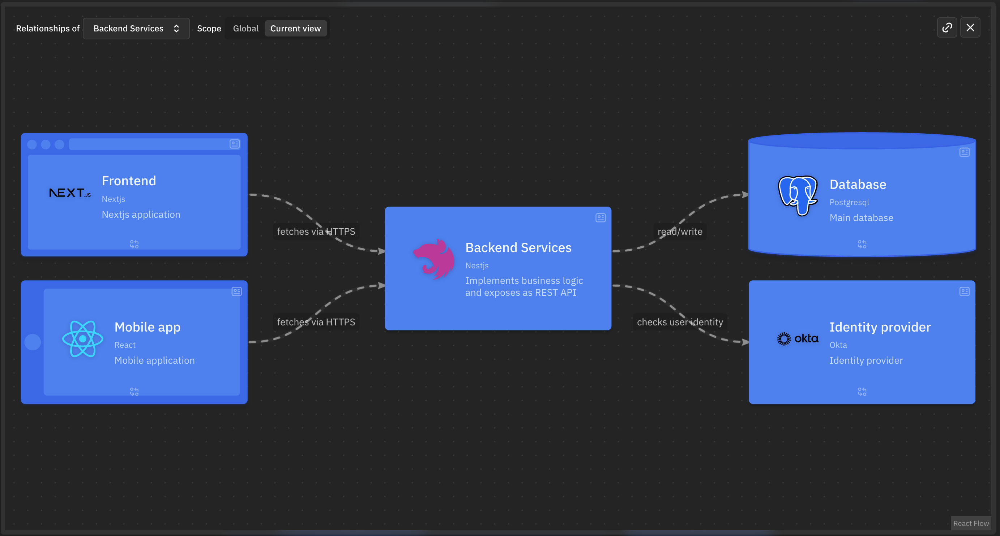
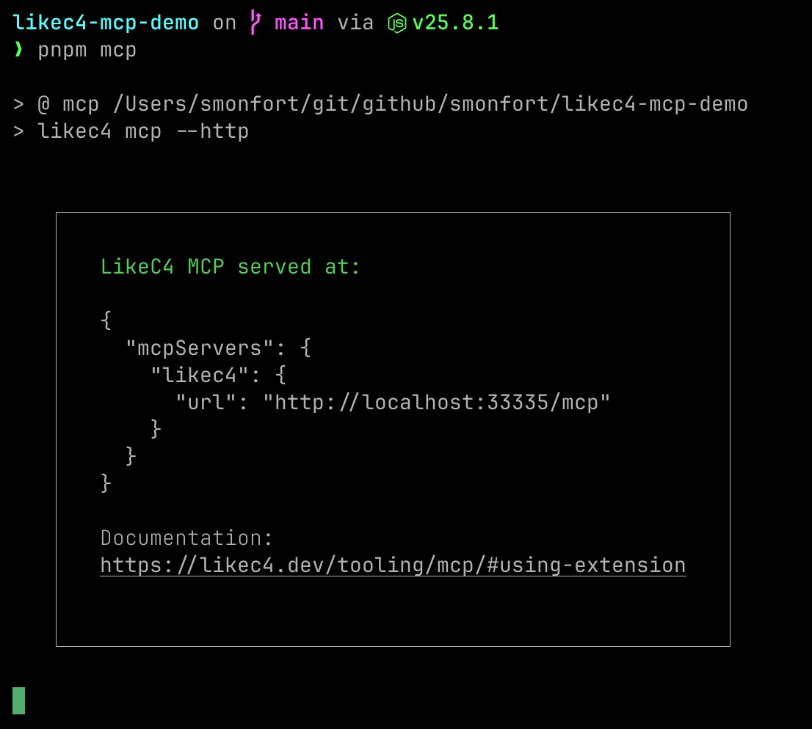
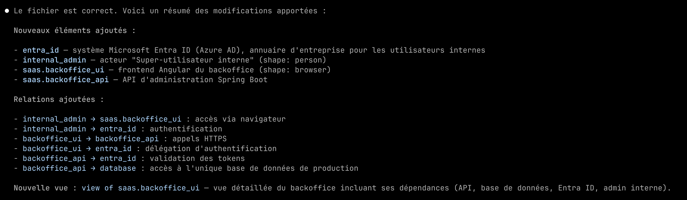
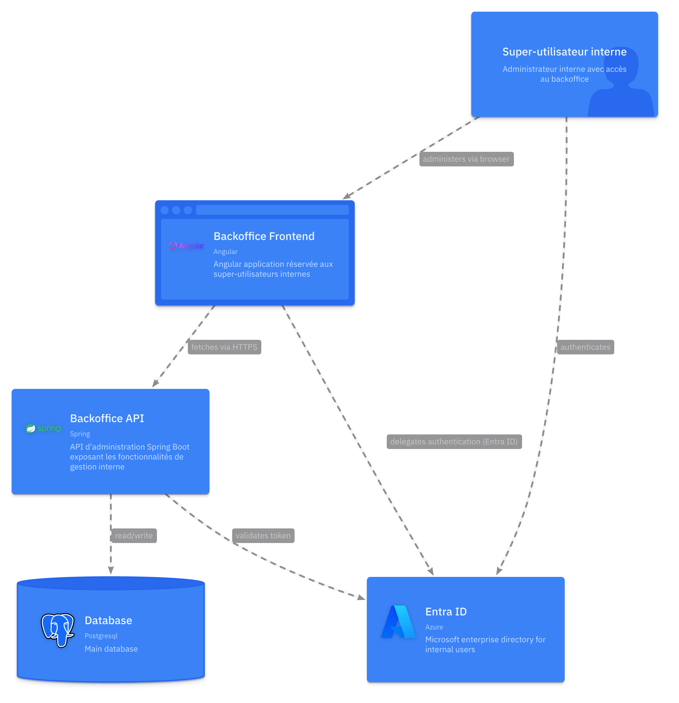

Architecture documentation has a bad reputation, and often for good reasons. Visio or Draw.io diagrams quickly drift from the actual code. Wikis accumulate stale pages that nobody updates. And when the time comes to present the architecture to a new team or stakeholders, you start from scratch. The architect is often reduced to a collection of drawings that can hardly be exploited programmatically.

[LikeC4](https://likec4.dev/) proposes a different approach: describe architecture as code, versionable in Git, from which interactive diagrams are generated automatically.

## Inspired by the C4 model

The [C4 model](https://c4model.com/), created by Simon Brown, popularised a structured approach to architecture documentation across four levels (Context, Container, Component, Code). [Structurizr](https://structurizr.com/), the reference tool created by Simon Brown himself, implements this approach with its own DSL and generates multiple view types (context, containers, components, deployment) from a single model.

LikeC4 draws direct inspiration from it, but pushes the logic further: where Structurizr imposes a fixed taxonomy (Person, SoftwareSystem, Container, Component), LikeC4 lets you define your own element types in a `specification` block. The [DSL](https://martinfowler.com/dsl.html) adapts to the real vocabulary of the project — you can name your elements `microservice`, `eventhub`, `team` or `database` according to what makes sense in your context, rather than forcing every concept into a predefined category.

A LikeC4 model is defined in `.c4` files with a declarative syntax that is relatively easy to pick up:

```hcl title="architecture.c4"

specification {
  element actor
  element system
  element component
}

model {
  customer = actor 'Customer' {
    description 'A user of our product'
  }
  cloud = system 'Our SaaS' {
    description 'Our product'
    ui = component 'Frontend'
    customer -> ui 'opens in browser'
    backend = component 'Backend'
    ui -> backend 'requests via HTTPS'
  }
  customer -> cloud 'uses to manage data'
}
```

The tool provides an [LSP](https://en.wikipedia.org/wiki/Language_Server_Protocol) that integrates with all major IDEs for an optimal editing experience (smart rename, goto definition, etc.).

From these files, LikeC4 generates interactive diagrams within a web page: you can zoom from the global context down to the internal components of a system, explore relationships, and share an interactive view with your team.

For more complex architectures, it is possible to define dynamic views that include only the elements relevant to each view.

## Key differentiators

- **Native versioning**. `.c4` files live in the Git repository, alongside the code. Architectural code reviews become possible: you can see exactly what changed, compare two versions, and discuss decisions in pull requests.

- **High-quality interactive navigation**. The generated graphical interface is remarkably clean, in my view. The view mechanism allows very fluid navigation through the different areas of the architecture.

- **Documentation integration**. LikeC4 integrates via a Vite plugin, React components, or Web Components. Diagrams can be embedded directly in Mkdocs documentation, an Astro site, or any tool that accepts HTML.

- **SDK provided**. LikeC4 provides an SDK that allows the architecture model to be exploited programmatically — for example, to produce ad hoc exports (e.g. listing flows as CSV, etc.). This SDK also makes it possible to _test_ the architecture documentation with standard tools like Jest, to ensure the model meets company standards. This is the beginning of CI/CD for architecture!

- **AI integration**. The project exposes the architecture model via an [MCP](https://modelcontextprotocol.io/docs/getting-started/intro) server, which allows an agent to query the architecture repository. We will come back to this point later.

## Demo project

I have set up a [demo project](https://github.com/smonfort/likec4-mcp-demo) that concretely illustrates the MCP integration mentioned above. It contains an architecture model of a fictional SaaS described with LikeC4, configured to be queried directly from Claude Code via the LikeC4 MCP server.

The `README.md` of the git repository contains all the instructions to run the project locally.

## Architecture walkthrough

I embed below the web component generated from the LikeC4 architecture model. For example, to integrate this web component into an Astro page:

```astro title="article.mdx"
<script is:inline src="/scripts/likec4-mcp-demo.js"></script>
<likec4-mcp-demo-view view-id="index"> </likec4-mcp-demo-view>
```

Which gives the following result. You can navigate through the architecture by clicking on each element.

<script is:inline src="/scripts/likec4-mcp-demo.js"></script>

<likec4-mcp-demo-view view-id="index"> </likec4-mcp-demo-view>

I particularly appreciate the ability to dynamically display the relationships (incoming and outgoing) of a given component. An example below with the backend component relationships. This makes it easy to verify that a component's responsibilities are correctly defined.



## Querying the architecture with an agent

The LikeC4 CLI natively supports launching an MCP server to access the architecture repository. The example project on GitHub is pre-configured with the necessary commands and configurations.



Let's run a first test from our Claude session with a minimal prompt to discover the architecture.

```ansi title="claude"
> Describe the application architecture of the SaaS project
```

Here is the agent's response, confirming its correct understanding of the architecture.

```ansi title="claude" wrap
⏺ Here is the application architecture of the SaaS project, modelled in architecture.c4:

  ---
  Landscape View (global context)

  Three main actors:

  ┌───────────────────┬─────────────────┬──────────────────────────────────┐
  │      Element      │      Type       │           Description            │
  ├───────────────────┼─────────────────┼──────────────────────────────────┤
  │ Customer          │ Actor           │ The end user of the product      │
  ├───────────────────┼─────────────────┼──────────────────────────────────┤
  │ Our SaaS          │ System          │ The application product          │
  ├───────────────────┼─────────────────┼──────────────────────────────────┤
  │ Identity Provider │ External System │ Identity management (Okta)       │
  └───────────────────┴─────────────────┴──────────────────────────────────┘

  Flows:
  - The Customer authenticates with the Identity Provider
  - The Customer uses the SaaS
  - The SaaS delegates to the Identity Provider for identity management

  ---
  Internal SaaS view

  The SaaS system is composed of 4 components:

  ┌─────────────────────────────────┬──────────────┬──────────────────────────────┐
  │           Component             │     Tech     │             Role             │
  ├─────────────────────────────────┼──────────────┼──────────────────────────────┤
  │ Frontend (saas.ui)              │ Next.js      │ Web application (browser)    │
  ├─────────────────────────────────┼──────────────┼──────────────────────────────┤
  │ Mobile App (saas.mobile)        │ React Native │ Mobile application           │
  ├─────────────────────────────────┼──────────────┼──────────────────────────────┤
  │ Backend Services (saas.backend) │ NestJS       │ Business logic, REST API     │
  ├─────────────────────────────────┼──────────────┼──────────────────────────────┤
  │ Database (saas.database)        │ PostgreSQL   │ Primary database             │
  └─────────────────────────────────┴──────────────┴──────────────────────────────┘

  Data flows

  Customer
    ├─ opens in browser ──────────► Frontend (Next.js)
    │                                    ├─ fetches via HTTPS ──► Backend (NestJS)
    │                                    └─ delegates auth ──────► Identity Provider (Okta)
    │
    └─ opens application ────────► Mobile App (React)
                                        ├─ fetches via HTTPS ──► Backend (NestJS)
                                        └─ delegates auth ──────► Identity Provider (Okta)

  Backend (NestJS)
    ├─ read/write ───────────────► Database (PostgreSQL)
    └─ checks user identity ─────► Identity Provider (Okta)

  ---
  In summary: classic two-client SaaS architecture (web + mobile) communicating via HTTPS
  with a NestJS backend, which relies on PostgreSQL for persistence and delegates
  authentication to Okta. Clients also delegate auth directly to Okta (OAuth/OIDC client flow).
```

## Evolving the architecture with an agent

Since the architecture is defined as code, it is easy to use an agent to evolve it. For example, imagine we want to add a back-office to our system. Let's try to evolve the architecture with the prompt below.

```ansi title="claude" wrap
> Add an administration back-office for the platform, accessible only by internal super-users. This back-office relies on the company's Entra ID directory. The back-office has an Angular frontend and a Spring Boot backend. It uses the single production database.
```

After a few moments of reflection, Claude proposes a perfectly coherent update to the `architecture.c4` file with the following additions.



Navigating the graphical interface, a new dedicated view for the back-office has been created, in accordance with my directives.



## Conclusion

We have only covered a small subset of the features offered by the tool here, but we have covered the essentials.

The tool is now mature (2,900+ stars on GitHub, MIT licence) and the DSL syntax is pleasant to write. After a few months of use, I also feel a real momentum in the project, with frequent updates, an ever-growing number of integrations, and an increasingly large community.

Without a shadow of a doubt, LikeC4 has become my new reference for describing the architecture of my projects.
