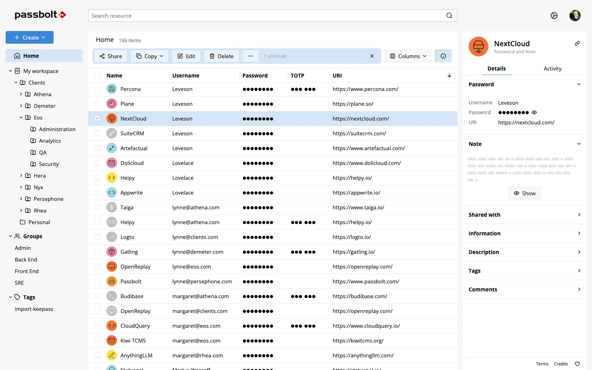

In nearly every technical team I've worked with, shared secret management is a blind spot. Passwords circulate in Slack or Teams messages, get stored in Confluence pages, in text files dropped on a network drive or a SharePoint. No controls, no governance, no audit trail. And yet, nobody really worries about it, until the day someone leaves the company and nobody knows what access they had...

## The golden rule: prioritize SSO integration

Before going further, let's state the fundamental rule: the **best shared secret** between users is the one that **doesn't exist**.

The right approach is to configure all applications to delegate user authentication to the company's identity provider using a standard protocol like OpenID Connect or SAML. This delivers several immediate benefits, at a minimum:

- **Traceability**: every login is tied to a named identity, and access to applications is centrally tracked
- **Access management**: permissions follow roles defined in the directory, along with any hardening policies (MFA, conditional access, password policies, etc.)
- **Simplified onboarding and offboarding**: no need to create accounts in each application when a user joins. Disabling an account in the directory automatically revokes all their access across every application.

This is all the more relevant since most modern SaaS tools now support this integration without friction, though it's worth noting that SSO configuration often requires subscribing to an Enterprise-tier plan, which can put smaller organizations on a tight budget at a disadvantage.

## The residual cases where secret sharing is unavoidable

In practice, SSO integration doesn't cover everything. There are always a few situations where a shared secret between users is unavoidable:

- **Local emergency accounts**: if the company's identity provider becomes unavailable, or if the integration between the application and the IdP is misconfigured, you need a way to regain access through a fallback. These emergency accounts must exist, be documented, tracked, and be accessible to several duly authorized trusted individuals, with the associated audit trail.
- **Legacy tools** that don't support SSO and require a shared generic account, even if this situation is fortunately becoming less and less common.

These are exactly the situations where [Passbolt](https://www.passbolt.com/) stands out as a particularly well-suited solution.

## Passbolt: an open-source password manager built for team collaboration

Passbolt is an open-source password manager designed explicitly for team sharing. It distinguishes itself from personal password management solutions ([KeePass](https://keepass.info/), [1Password](https://1password.com), [Dashlane](https://www.dashlane.com/), etc.) through its governance model. The tool makes it possible to store and organize credentials and apply fairly advanced governance to them, with access controls and a detailed audit trail.

A few features worth highlighting:

- **Group sharing**: a secret can be shared with an entire group (for example, the SRE team), which avoids managing access individually every time team membership changes.
- **OTP sharing**: this is often a major pain point with shared accounts. The first admin who sets up two-factor authentication loads the QR code on their phone, and nobody else has access to it. Passbolt lets you store and share the TOTP secret with the relevant group.
- **SCIM and SSO integration**: Passbolt supports automatic account synchronization via SCIM with major identity providers (Okta, Entra ID, etc.), and allows logging into Passbolt itself via SSO.
- **CI/CD integration**: it's possible to query Passbolt from a pipeline to inject secrets into an automated process, though I haven't had the chance to try this personally. [Vault](https://www.hashicorp.com/en/products/vault) by HashiCorp, or its open-source fork [OpenBao](https://openbao.org/), seem more relevant and functionally richer for those use cases.
- **Browser extensions**: to automatically pre-fill credentials from secrets stored in the tool.



## Deployment

Installing Passbolt is straightforward and covers most common environments. The tool offers several official methods: a dedicated installer for Linux distributions (Debian, Ubuntu, RHEL), a `docker-compose` setup for a quick start, and a Helm chart for Kubernetes environments.
The architecture remains minimal in all cases: a PHP server and a MariaDB database.

```bash title="docker-compose installation script"
curl -LO  "https://download.passbolt.com/ce/docker/docker-compose-ce.yaml"
curl -LO  "https://github.com/passbolt/passbolt_docker/releases/latest/download/docker-compose-ce-SHA512SUM.txt"
sha512sum -c docker-compose-ce-SHA512SUM.txt && echo "Checksum OK" || (echo "Bad checksum. Aborting" && rm -f docker-compose-ce.yaml)
docker compose -f docker-compose-ce.yaml up -d
```

The Community Edition covers the needs of small to medium-sized teams. Advanced features (SCIM, SSO, audit reports) require the Pro version, which remains reasonably priced.

## Conclusion

Passbolt is, in my view, one of the best allies for CISOs and security managers. It helps strengthen a company's digital hygiene by effectively addressing the shared password management problem.

It's a tool I'd particularly recommend to teams that don't yet have a structured answer to this issue, or that rely on makeshift solutions like a KeePass vault shared over a network drive. The improvement in governance and peace of mind is immediate.
