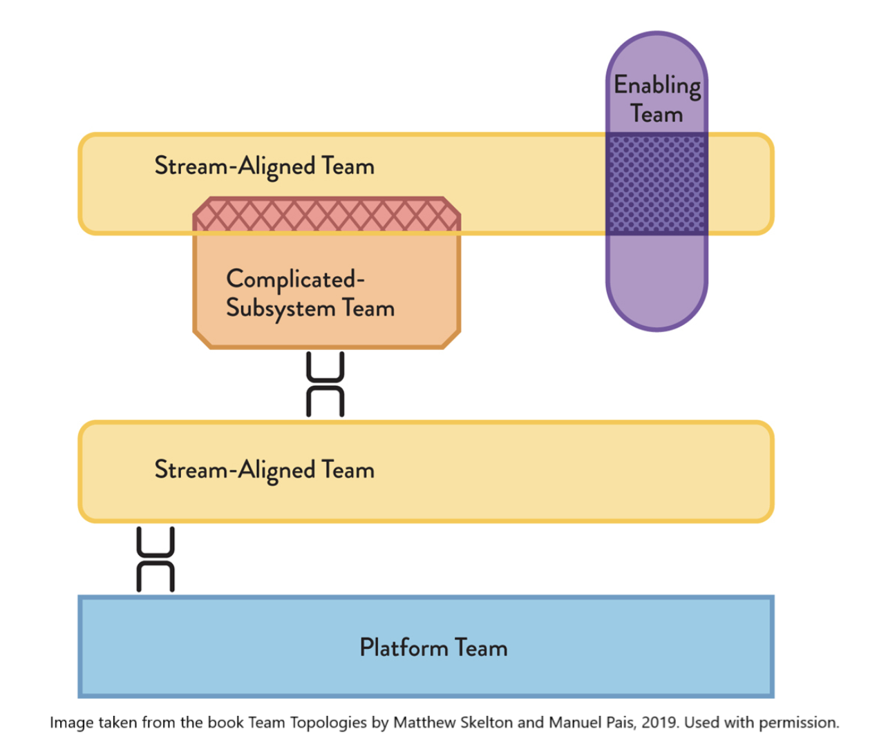

In 1968, [Mel Conway](https://en.wikipedia.org/wiki/Melvin_Conway) published an observation that still holds today: _"Organizations which design systems are constrained to produce designs which are copies of the communication structures of these organizations."_ In other words, if your organization is divided into frontend, backend, and database teams, your architecture will mirror that split — whether you want it to or not.

## Conway's Law is unavoidable

[Team Topologies](https://teamtopologies.com/), written by Matthew Skelton and Manuel Pais, takes this observation as its starting point and proposes a new approach to team design. Rather than fighting Conway's Law, the book treats it as a given and encourages organizations to deliberately structure their teams to produce the architecture they actually want.

It's an important shift in perspective, one that invites us to treat the organization itself as something to be designed. Originally focused on DevOps topics in the early 2010s, the approach has since expanded to cover team design across the entire value chain.

## Four team topologies, no more!

Team Topologies offers a framework for clarifying responsibilities across teams while keeping cognitive load in check. The method emphasizes the importance of small, stable teams — ideally seven to nine people — with all the skills needed to carry out their mission and minimal turnover.

To make the organization explicit, the book describes four (and only four) fundamental team types:

- **Stream-aligned**: the primary team type, aligned to a continuous flow of value (a product, a user journey, a business domain). It is end-to-end autonomous — from capturing requirements to monitoring in production — without handing off to another team to deliver value to end users. The other three team types exist to reduce the burden on stream-aligned teams.

- **Enabling**: cross-functional specialists who help stream-aligned teams build capabilities in a given area (security, observability, architecture...). Their mission is inherently temporary: an effective enabling team makes the teams it supports self-sufficient. These teams are also expected to explore new territory ahead of time, in the interest of stream-aligned teams.

- **Complicated-subsystem**: a team of specialists responsible for a component that requires deep expertise (a computation engine, video processing, a recommendation algorithm...) that would exceed the cognitive load of a generalist team.

- **Platform**: provides a set of internal services to stream-aligned teams in a self-service model, packaged as a coherent internal product. The goal is for a stream-aligned team to be able to deploy, monitor, and operate its service independently, without relying on an infra team for every step.

## Three interaction modes

Identifying team types is not enough. You also need to define how teams interact — and when to evolve those interactions. Team Topologies highlights three interaction modes:

- **Collaboration**: two teams work closely together for a defined period to explore uncertain territory or validate an approach.

- **X-as-a-Service**: one team consumes what another produces, with minimal coordination. Responsibilities are clear, interfaces well-defined.

- **Facilitating**: one team helps another develop a capability or overcome a blocker, with the explicit goal of making it self-sufficient. This is the natural interaction mode for enabling teams.

These modes are not fixed — organizations need to be able to evolve them over time. For example, two teams might start in collaboration mode to explore a complex topic together, sharing responsibility, then shift to X-as-a-Service once the boundaries are clearly identified and agreed upon.

## Additional resources

Alongside the book, the authors provide a standard graphical notation for representing team types and their interactions. An official [GitHub repository](https://github.com/TeamTopologies/Team-Shape-Templates) offers templates for a variety of tools (PowerPoint, Excalidraw, Diagram.net, Figma, etc.) to model your organization using this notation.

## Conclusion

Team Topologies is a short, dense, and immediately applicable book. It doesn't offer a one-size-fits-all model to copy-paste, but a shared vocabulary for designing the organization that best fits your context.

I find the approach very pragmatic and far simpler than a heavyweight framework like SAFe. Beyond the team type taxonomy, what I appreciate most is making collaboration modes between teams explicit — it makes the organization readable for everyone and significantly more effective.
