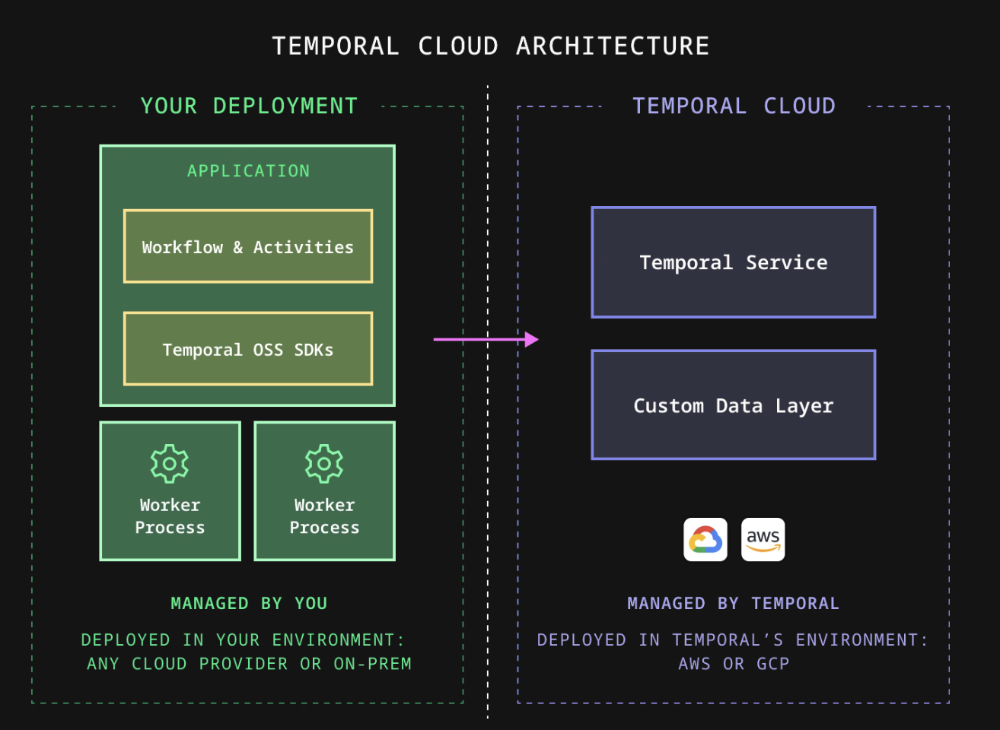
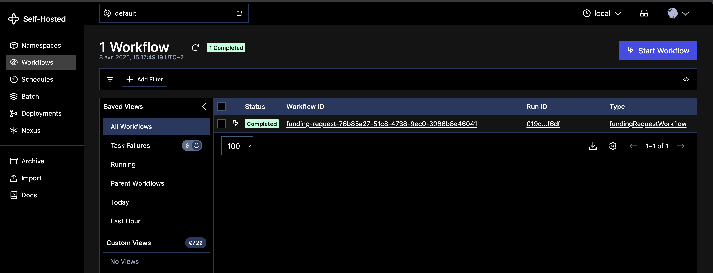
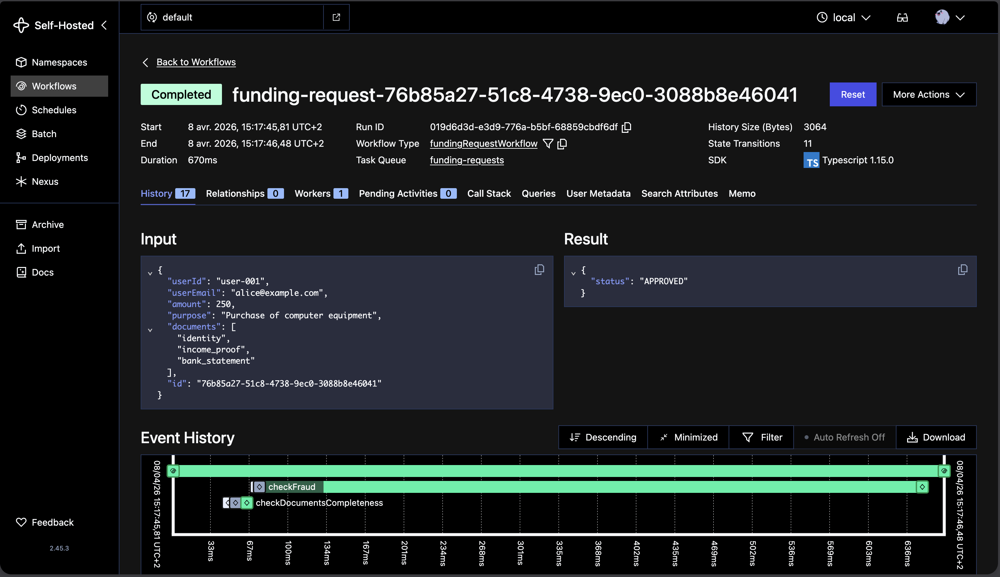
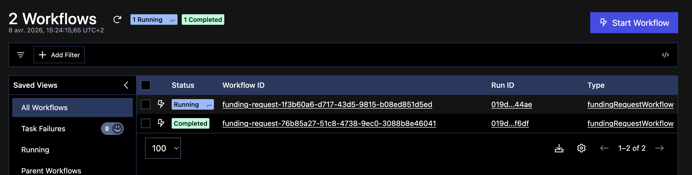
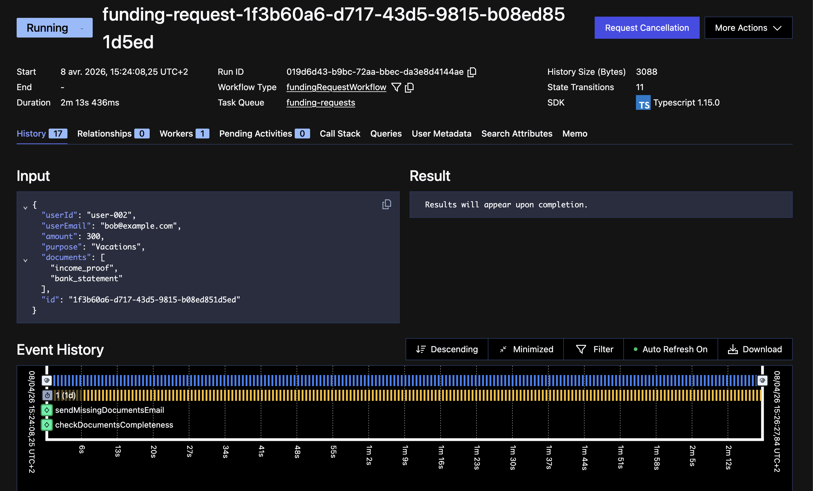
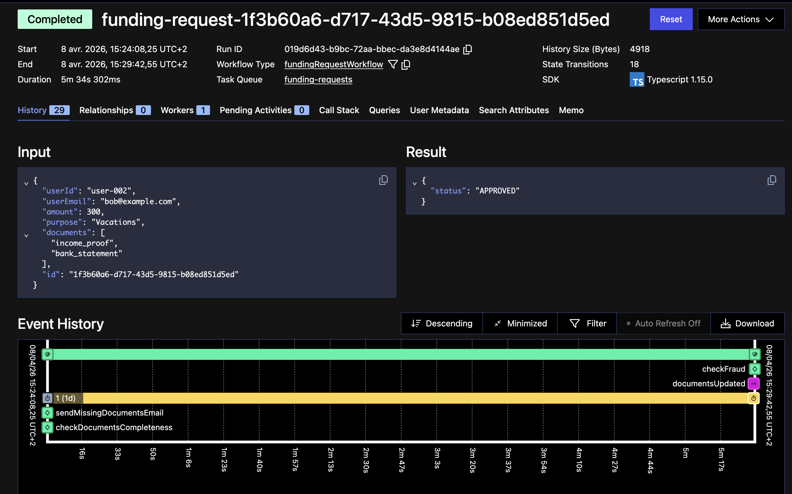

Écrire un programme qui gère un processus interruptible est bien plus difficile qu'il n'y paraît. Dès qu'un workflow dure plus de quelques secondes, qu'il attend une réponse externe, relance un utilisateur, ou nécessite une validation humaine, le code se remplit de logique défensive : gestion des timeouts, reprise sur erreur, persistance d'état, combinatoires exponentielles, gestion de l'idempotence... C'est souvent là que les bugs s'accumulent, et que la complexité accidentelle prend le dessus.

C'est exactement le problème que la **durable execution** cherche à résoudre.

## La _durable execution_ : l'exécution tolérante aux pannes

La _durable execution_ est un modèle d'exécution qui garantit qu'un programme survit aux pannes : redémarrages de serveur, timeouts réseau, coupures de service tiers. L'état du programme est automatiquement persisté, et l'exécution reprend là où elle s'était arrêtée, sans que le développeur ait à le gérer explicitement.

Concrètement, cela apporte trois choses :

- **Fiabilité** : le processus est tolérant aux pannes sans code défensif supplémentaire
- **Simplicité** : le code exprime ce que le processus doit faire, pas ce qui pourrait mal tourner
- **Vélocité** : on supprime de larges pans de logique d'erreur et de persistance d'état

## Temporal : l'implémentation de référence

Ce concept me rappelle mes expériences avec les solutions de type BPM de la fin des années 2000. L'idée était séduisante sur le papier : modéliser visuellement des processus, orchestrer des tâches humaines et automatisées, gérer les états, etc. Mais les solutions de l'époque étaient lourdes (doux euphémisme !), difficiles à industrialiser, et très loin de la philosophie _as-code_.

Depuis ce temps, à quelques reprises, j'ai continué à avoir l'intuition qu'une solution de type BPM pourrait répondre aux problématiques métiers de mes clients. J'ai continué à avoir une veille active sur certaines solutions, comme [Activiti](https://www.activiti.org/), mais sans trouver de contexte propice pour les mettre en œuvre à grande échelle.

[Temporal](https://temporal.io/) me donne aujourd'hui l'impression de retrouver ces facilités, avec une approche radicalement différente : le workflow s'écrit dans le langage de son choix (Go, TypeScript, Java, Python...), s'exécute comme du code ordinaire, et bénéficie de toutes les garanties de la durable execution de manière transparente. Pas besoin de définir un BPMN en XML, pas de designer graphique obligatoire, juste du code versionnable et testable.

## Vue d'ensemble de l'architecture de Temporal

Dans une vision simplifiée, l'architecture globale de Temporal est divisée en deux parties : le cluster Temporal et les applications déployées côté utilisateur.



Le cluster Temporal peut être déployé on-premise, sur votre environnement Cloud ou via l'offre Temporal Cloud. Le cluster Temporal se charge de persister les états des workflows et de dispatcher les traitements à exécuter sur les différents workers.

Côté utilisateur, nous retrouvons donc les workers qui exécutent vos workflows et activités sous le pilotage du cluster Temporal. Pour démarrer un workflow ou requêter un workflow en cours, votre application utilise le SDK Temporal qui permet une communication en gRPC avec le cluster Temporal.

## Développement d'un workflow

Les SDK de Temporal permettent simplement d'implémenter des workflows complexes, avec une bonne expérience développeur.

Un workflow Temporal orchestre des activités. Une activité est une simple fonction traditionnelle qui exécute une action (de courte ou de longue durée), impliquant souvent une interaction avec le monde extérieur, comme l'envoi d'e-mails, l'exécution de requêtes réseau, l'écriture dans une base de données ou l'appel d'une API. Ces opérations sont susceptibles d'échouer. En cas d'échec d'une activité, Temporal la relance automatiquement, ce qui permet de se concentrer uniquement sur la logique métier. Un exemple d'activité ci-dessous en Typescript.

```ts title="greet.ts"
export async function greet(name: string): Promise<string> {
  return `Hello, ${name}!`;
}
```

Les workflows Temporal sont résilients : ils peuvent être actifs pendant des années, même en cas de défaillance de l’infrastructure sous-jacente. Par exemple, si le serveur applicatif connaît une défaillance alors qu'un workflow est en cours d'exécution, Temporal redémarre automatiquement le workflow en restaurant l'état antérieur à la panne, ce qui permet de reprendre l'exécution sans perte de données. Ci-dessous, un exemple minimaliste de workflow qui appelle l'activité écrite précédemment.

```ts title="workflow.ts"
import { proxyActivities } from '@temporalio/workflow';
// Only import the activity types
import type * as activities from './activities';

const { greet } = proxyActivities<typeof activities>({
  startToCloseTimeout: '1 minute',
});

/** A workflow that simply calls an activity */
export async function example(name: string): Promise<string> {
  return await greet(name);
}
```

Le SDK Temporal permet aux applications d'interagir avec les workflows via deux mécanismes fondamentaux :

- **Signals** : pour envoyer un événement à un workflow en cours d'exécution. Par exemple, demander un changement de statut, une validation, etc.
- **Queries** : pour interroger l'état courant d'un workflow sans l'interrompre. Par exemple, pour extraire une variable ayant été calculée au sein du workflow.

Les _signals_ sont pris en compte au sein du workflow par des _handlers_ qui peuvent modifier l'état interne du workflow. L'exemple suivant comporte un _handler_ qui permet de traiter le signal de validation d'une demande. Dans l'exemple ci-dessous, le workflow attend indéfiniment que le signal soit reçu (logique qui peut être enrichie si besoin avec des notions de timeout).

```ts title="workflow.ts"
import * as wf from '@temporalio/workflow';

// 👉 Use the object returned by defineSignal to set the Signal handler in
// Workflow code, and to send the Signal from Client code.
export const approve = wf.defineSignal<[ApproveInput]>('approve');

export async function greetingWorkflow(): Promise<string> {
  let approvedForRelease = false;
  let approverName: string | undefined;

  wf.setHandler(approve, (input) => {
    // 👉 A Signal handler mutates the Workflow state but cannot return a value.
    approvedForRelease = true;
    approverName = input.name;
  });

  // Wait indefinitely for the approval signal
  await condition(() => approvedForRelease);
}
```

## Cas d'usage : une demande de financement

Pour explorer Temporal concrètement, j'ai construit un [prototype de demande de financement](https://github.com/smonfort/temporal-funding-demo) en TypeScript. Le scénario est volontairement simple mais illustre bien les capacités de l'outil : c'est un processus potentiellement long, qui mêle traitements automatisés et validation humaine.

Le processus métier minimaliste suit ces étapes :

1. **Soumission de la demande** : le prospect envoie sa demande avec ses coordonnées, le projet à financer, et des pièces justificatives
2. **Vérification des pièces** : le système contrôle la complétude du dossier ; si des pièces manquent, il relance le client par mail toutes les 24h pendant une semaine
3. **Analyse anti-fraude** : une fois le dossier complet, un service tiers évalue le risque
4. **Validation** : pour les dossiers à faible montant, la validation est automatique ; au-delà d'un seuil, une validation humaine est requise

Ce type de processus me semble être particulièrement compatible avec un design de type _durable execution_ : plusieurs jours peuvent s'écouler entre la soumission et la décision finale, avec des interactions asynchrones à chaque étape, et de multiples causes d'erreur techniques et fonctionnelles.

## Architecture du prototype

Le prototype s'appuie sur un serveur Temporal lancé en mode développement à l'aide d'une configuration `docker-compose`.

Une **API REST** développée en [Fastify](https://fastify.dev/) permet de créer une demande de financement. Cette demande instancie un workflow à l'aide du [SDK TypeScript Temporal](https://docs.temporal.io/develop/typescript). L'API permet d'interagir avec les workflows en cours via des _signals_ et _queries_.

L'API permet également d'uploader les pièces manquantes, de lister les demandes en attente de validation, puis d'approuver ou de refuser une demande.

La console d'administration Temporal offre une visibilité complète sur l'exécution des workflows : historique des événements, état courant, durée, erreurs éventuelles. C'est un atout considérable pour le debugging et la supervision opérationnelle.

## Illustration

Testons ensemble ce prototype en commençant par cloner le [repository GitHub](https://github.com/smonfort/temporal-funding-demo).

```sh
git clone https://github.com/smonfort/temporal-funding-demo.git
```

Lancez le cluster Temporal en tâche de fond. La persistance est gérée à l'aide d'un volume local.

```sh
docker-compose up -d
```

Puis lancez l'application de demande de crédit.

```sh
pnpm install
pnpm start
```

Maintenant que l'application est lancée, prenons d'abord un premier exemple simple : une demande de financement complète, pour laquelle l'appel anti-fraude ne retourne aucune erreur, pour un montant inférieur au seuil de validation humaine. Selon notre conception, la demande est acceptée. Soumettons cette demande à l'API.

```sh
curl -s -X POST http://localhost:3000/funding-requests \
  -H "Content-Type: application/json" \
  -d '{
    "userId": "user-001",
    "userEmail": "alice@example.com",
    "amount": 250,
    "purpose": "Purchase of computer equipment",
    "documents": ["identity", "income_proof", "bank_statement"]
  }'
```

L'API nous retourne une réponse OK avec l'identifiant du workflow créé.

```json
{
  "id": "76b85a27-51c8-4738-9ec0-3088b8e46041",
  "status": "INITIATED",
  "message": "Request created and workflow started."
}
```

La console d'administration de Temporal est accessible à cette adresse : http://localhost:8233/
La section _Workflows_ affiche bien ce workflow au statut `Completed`.



Le détail du workflow affiche les différentes activités dans une vue chronologique. Chaque activité est visible sur le chronographe, avec ses données d'entrées et de sortie. On remarque l'activité `checkFraud` pour laquelle un bouchon simule une légère latence, ce qui explique le temps passé dans cette activité.



Prenons maintenant un deuxième exemple. Une demande de financement est faite avec des justificatifs incomplets. Le client est relancé afin de fournir toutes les pièces justificatives nécessaires.

Soumettons donc une nouvelle demande incomplète (sans justificatif d'identité valide).

```sh
curl -s -X POST http://localhost:3000/funding-requests \
  -H "Content-Type: application/json" \
  -d '{
    "userId": "user-002",
    "userEmail": "bob@example.com",
    "amount": 300,
    "purpose": "Vacations",
    "documents": ["income_proof", "bank_statement"]
  }'
```

La console affiche un nouveau workflow au statut `Running`.



Le détail du workflow indique qu'une activité a été exécutée pour envoyer un mail au client et qu'un timer a été lancé. Au bout de 24h, sans retour du client, un nouveau mail sera envoyé.



Le client réagit avant ces 24h et soumet la pièce manquante, action que nous pouvons simuler avec cet appel d'API.

```sh
curl -s -X POST "http://localhost:3000/funding-requests/1f3b60a6-d717-43d5-9815-b08ed851d5ed/documents" \
  -H "Content-Type: application/json" \
  -d '{
    "documents": ["identity", "income_proof", "bank_statement"]
  }'
```

L'API envoie alors un signal au workflow qui reprend son exécution : les documents sont bien à jour, l'appel fraude est ok, ce qui permet de clôturer automatiquement la demande.



## Conclusion

Nous n'avons exploré que de manière très superficielle les fonctionnalités de Temporal. L'outil s'impose pour moi comme la solution la plus élégante et moderne que j'ai pu expérimenter pour orchestrer des processus métier durables et fiables. L'approche workflow-as-code est un gain significatif par rapport aux BPM classiques : le code est lisible, testable, et versionnable comme le reste du projet. Je vous invite à tester !
