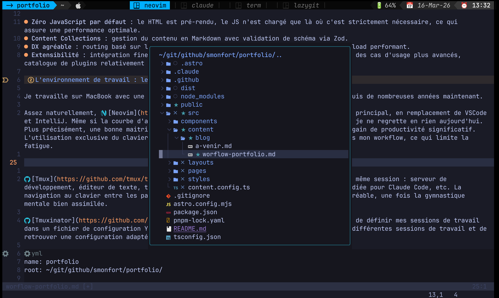
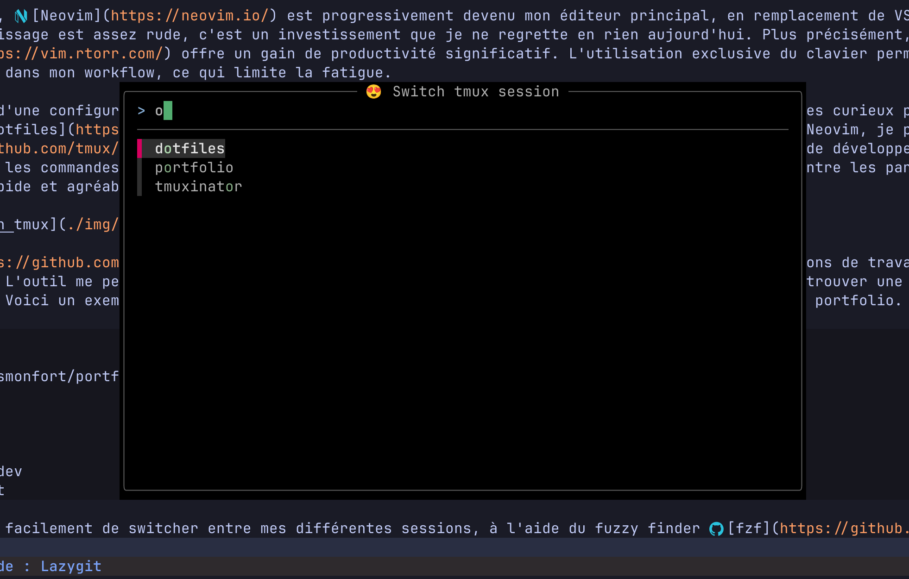
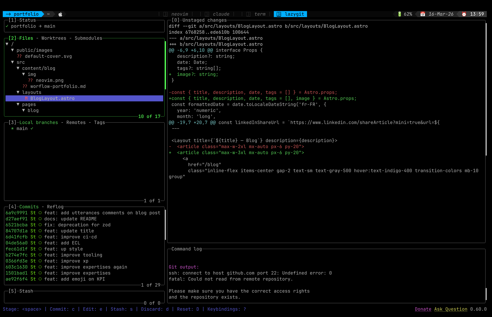
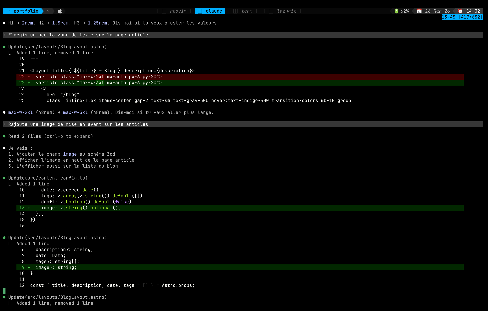
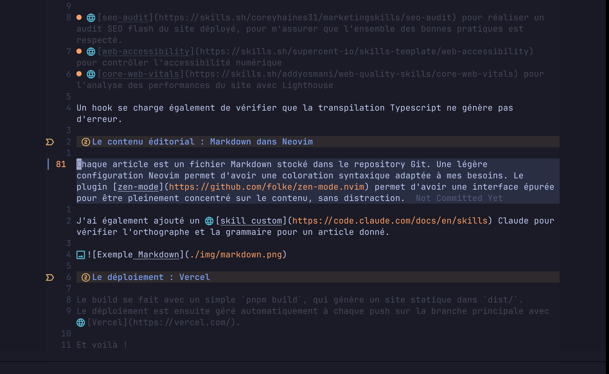

À l'heure du vibe-coding, construire un portfolio devient une commodité. Je vous explique ici mon workflow de développement pour construire ce site, en mettant en lumière quelques outillages que j'apprécie particulièrement.

## Le choix du framework : Astro

Par le passé, j'ai pu expérimenter un certain nombre de générateurs de sites statiques, dont [Hugo](https://gohugo.io/) et [Gatsby](https://www.gatsbyjs.com/), avec des succès variés.

Désormais, mon choix se tourne par défaut vers [Astro](https://astro.build), que l'on ne présente plus. Ce qui m'a convaincu :

- **Zéro JavaScript par défaut** : le HTML est pré-rendu, le JS n'est chargé que là où c'est strictement nécessaire, ce qui assure une performance optimale.
- **Content Collections** : gestion du contenu en Markdown avec validation de schéma via Zod.
- **DX agréable** : routing basé sur les fichiers, intégration Tailwind sans friction, live reload performant.
- **Extensibilité** : intégration fine avec des bibliothèques plus riches comme React ou Vue pour des cas d'usage plus avancés, catalogue de plugins relativement riche, etc.
- **Static first** : un déploiement facile à mettre en place, une surface d'attaque réduite au maximum.

## L'environnement de travail : le terminal !

Je travaille sur un MacBook avec une utilisation intensive et quasi exclusive du terminal depuis de nombreuses années maintenant.

Assez naturellement, [Neovim](https://neovim.io/) est progressivement devenu mon éditeur principal, en remplacement de VSCode et IntelliJ. Même si la courbe d'apprentissage est assez rude, c'est un investissement que je ne regrette en rien aujourd'hui. Plus précisément, une bonne maîtrise des [VIM motions](https://vim.rtorr.com/) offre un gain de productivité significatif. L'utilisation exclusive du clavier permet également de limiter les sources de friction dans mon workflow, ce qui limite la fatigue.

Certains disposent d'une configuration Neovim très avancée ; je préfère garder une approche assez minimaliste. Les curieux pourront le vérifier en consultant mes [dotfiles](https://github.com/smonfort/dotfiles). Plutôt que de complexifier ma configuration Neovim, je préfère m'appuyer sur [Tmux](https://github.com/tmux/tmux/wiki) pour gérer plusieurs fenêtres dans une même session : serveur en mode développement, éditeur de texte, terminal libre pour les commandes ponctuelles, fenêtre dédiée pour Claude Code, etc. La navigation au clavier entre les panneaux et les fenêtres est particulièrement rapide et agréable, une fois la gymnastique mentale bien assimilée.



[Tmuxinator](https://github.com/tmuxinator/tmuxinator) complète le tout en me permettant de définir mes sessions de travail dans un fichier de configuration YAML. L'outil me permet de switcher rapidement entre mes différentes sessions de travail et de retrouver une configuration adaptée pour chacun des projets. Voici un exemple minimaliste ci-dessous adapté à mes besoins pour la construction de ce portfolio, avec une session qui ouvre quatre fênetres :

- Neovim ouvert sur le répertoire du portfolio
- une session Claude Code
- le serveur Astro en mode développement
- Lazygit pour le suivi du code source

```yml
name: portfolio
root: ~/git/github/smonfort/portfolio/

windows:
  - neovim: vi
  - claude: claude
  - term: pnpm run dev
  - lazygit: lazygit
```

Une popup me permet de switcher très rapidement entre mes différentes sessions Tmux, à l'aide du fuzzy finder [fzf](https://github.com/junegunn/fzf).



## Le suivi du code source : Lazygit

Pendant longtemps, j'ai utilisé Git exclusivement en ligne de commande. Puis j'ai découvert [Lazygit](https://github.com/jesseduffield/lazygit), et je n'en suis jamais revenu.

Me sentant à l'aise dans des interfaces de type TUI, Lazygit me permet beaucoup plus facilement d'avoir une bonne hygiène sur mon historique Git. Bon nombre de commandes avancées sont rendues très accessibles, à condition d'avoir une bonne maîtrise des fondamentaux de Git. Je garde donc en permanence une fenêtre ouverte avec Lazygit pour contrôler finement mes stagings, commits et pushs.



## L'interface graphique : Claude Code

N'ayant que des talents limités de designer, Claude Code m'a accompagné dans la construction des différentes pages. De manière progressive, à l'aide d'une série de prompts relativement simples et de demandes de corrections ciblées, je suis parvenu à un rendu visuel qui me convenait tout à fait. Par exemple, ci-dessous, j'indique vouloir une image de mise en avant pour chacun des articles. Rien de plus simple, Claude s'en charge pour moi.



Pour s'assurer que Claude prenne bien en compte les dernières versions des API Astro, je le configure avec le [serveur MCP](https://docs.astro.build/fr/guides/build-with-ai/#serveur-mcp-dastro-docs) fourni par Astro.

J'utilise aussi les skills suivants pour vérifier la qualité des développements :

- [seo-audit](https://skills.sh/coreyhaines31/marketingskills/seo-audit) pour réaliser un audit SEO flash du site déployé, pour m'assurer que l'ensemble des bonnes pratiques est respecté.
- [web-accessibility](https://skills.sh/supercent-io/skills-template/web-accessibility) pour contrôler l'accessibilité numérique
- [core-web-vitals](https://skills.sh/addyosmani/web-quality-skills/core-web-vitals) pour l'analyse des performances du site avec Lighthouse

Un hook se charge également de vérifier que la transpilation Typescript ne génère pas d'erreur.

## L'écriture du contenu : Markdown dans Neovim

Chaque article est un simple fichier Markdown stocké dans le repository Git. Une légère configuration Neovim permet d'avoir une coloration syntaxique adaptée à mes besoins.

J'ai également ajouté un [skill custom](https://code.claude.com/docs/en/skills) Claude pour vérifier l'orthographe et la grammaire pour un article donné.



## Le déploiement : Vercel

Le build se fait avec un simple `pnpm build`, qui génère un site statique dans `dist/`.
Le déploiement est ensuite géré automatiquement à chaque push sur la branche principale avec [Vercel](https://vercel.com/).

Et voilà !
